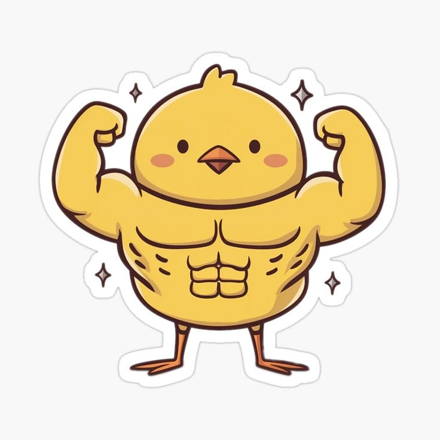

<h1 align="center">
Hello, I'm Vu Tien Dat!
	
</h1>

<h2 align="left">🤖 About me: </h2>

<table>
  <tr>
    <td width="70%" valign="top">
      

        🎓 Student at the University of Science, Vietnam National University, Hanoi (VNU-HUS).
      

      

        📚 Department of Mathematics, Mechanics and Informatics.
      

      

        💡 Major: Mathematics and Computer Science.
      

      

        🧠 Interested in:
		  <ul>
			<li>Competitive Programming</li>
			<li>Algorithms & Data Structures</li>
			<li>Data Engineering</li>
			<li>Backend
			<li>Machine Learning</li>
		  </ul>
      

	  

        🔭 Check out my blog at ...
      

    </td>
    <td width="30%" align="center" valign="top">
      
    </td>
  </tr>
</table>
 

<h2 align="left">📫 Connect with me:</h2>

  
	&nbsp;&nbsp;&nbsp;
  
	&nbsp;&nbsp;&nbsp;
   
	&nbsp;&nbsp;&nbsp;
  
  &nbsp;&nbsp;&nbsp;

 

<h2 align="left">🔧 Technologies & Tools:</h2>
<!-- <table align = "center" width = "100%">
  <tr>
    <td align="center" >
      
    </td>
    <td align="center">
      
    </td>
    <td align="center">
      
    </td>
    <td align="center">
      
    </td>
    <td align="center">
      
    </td>
    <td align="center" >
      
    </td>
  </tr>
  <tr>
    <td align="center" >
      
    </td>
    <td align="center" >
      
    </td>
    <td align="center" >
      
    </td>
    <td align="center" >
      
    </td>
    <td align="center" >
      
    </td>
    <td align="center">
      
    </td>
  </tr>
</table> -->

  

<h2 align="left">📈 My Activities: </h2>

  <picture>
    <source media="(prefers-color-scheme: dark)" srcset="https://raw.githubusercontent.com/vutiendat2302/vutiendat2302/output/github-contribution-grid-snake-dark.svg">
    <source media="(prefers-color-scheme: light)" srcset="https://raw.githubusercontent.com/vutiendat2302/vutiendat2302/output/github-contribution-grid-snake.svg">
    
  </picture>

<h2 align="left">📊 GitHub Overview:</h2>

<table align = "center">
  <tr width = "100%">
    <td width = "50%" align="center">
      
    </td>
    <td width = "50%" align="center">
      
    </td>
  </tr>
</table>
 

<h2 align="left">️🎯 Certificates: </h2>

<table align="center" width="100%">
  <tr>
    <td align="left" width="60%" valign="top">
      
       
      
       
      
       
      
       
      
       
      
       
      
       
      
       
      
       
      
       
      
       
      
       
      
    </td>
    <td align="center" width="40%" valign="top">
      
    </td>
  </tr>
</table>
